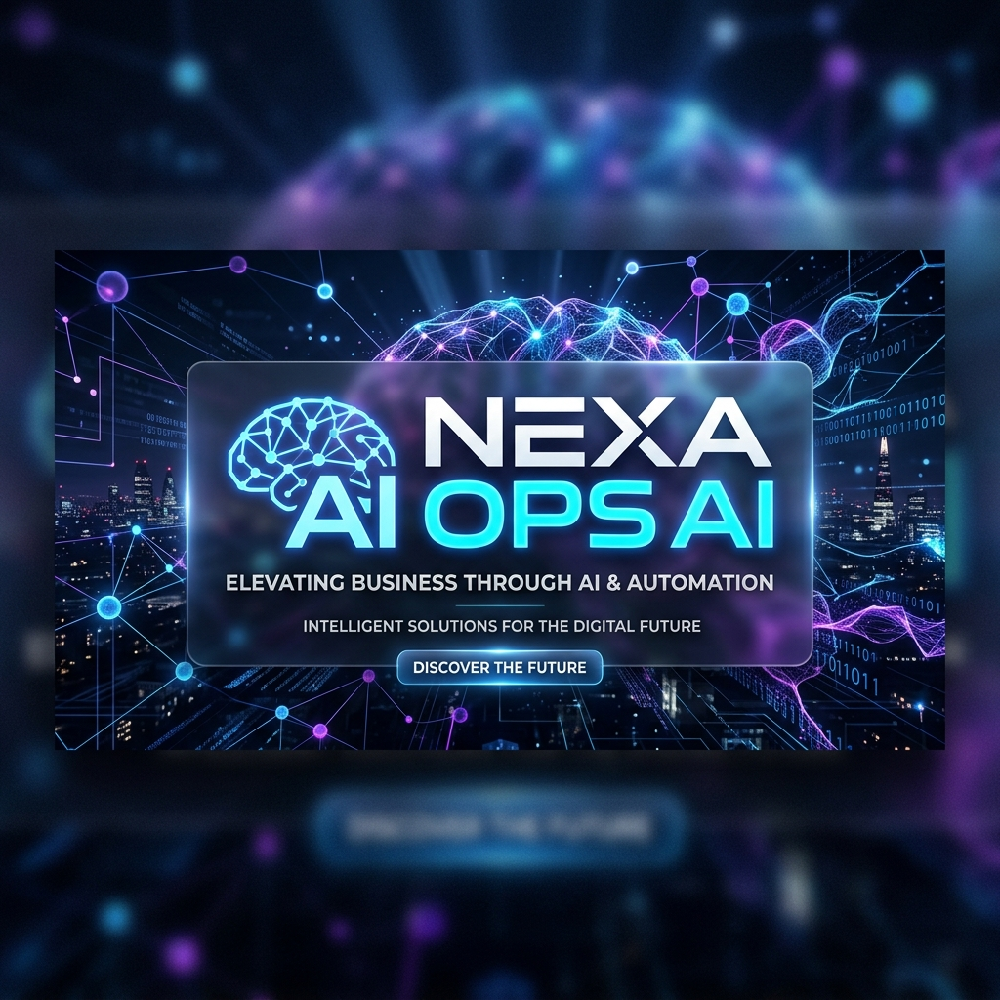

# 🌌 NexaOps AI - Ecosystem

Bienvenido al centro de comando de **NexaOps AI**. Este repositorio centraliza la infraestructura de una agencia de IA de alto rendimiento, conectando agentes inteligentes, gestión de clientes y automatización de WhatsApp.

---

## 🚀 Acceso Rápido (Cloud & Local)

### ☁️ Servicios en la Nube
El cerebro del sistema está desplegado en **Vercel**, gestionando la lógica de negocio y las integraciones.

*   **🌐 API Central**: [https://api-virid-six-51.vercel.app](https://api-virid-six-51.vercel.app)
*   **🔌 Health Check**: [https://api-virid-six-51.vercel.app/api/whatsapp/health](https://api-virid-six-51.vercel.app/api/whatsapp/health)

### 💻 Portales Locales (Interfaces)
Para ejecutar estas interfaces, puedes abrirlas directamente desde tu explorador o usar un servidor local (Live Server).

*   **🤖 Agent Portal**: [Abrir Portal de Agentes](./agent-portal/index.html)
    *   *Interfaz inspirada en Claude para creación y despliegue de agentes.*
*   **📊 Business Dashboard**: [Abrir Panel de Control](./dashboard/index.html)
    *   *Gestión centralizada de proyectos, leads y facturación.*

---

## 🛠️ Stack Tecnológico

| Capa | Tecnología | Función |
| :--- | :--- | :--- |
| **Backend** | Node.js / Express | Lógica de servidor y Webhooks. |
| **Frontend** | Vanilla JS / Tailwind | Interfaces ultra-rápidas y premium. |
| **Database** | Supabase (PostgreSQL) | Persistencia de datos y autenticación. |
| **WhatsApp** | Green API | Comunicación estable para el mercado LATAM. |
| **Hosting** | Vercel | Despliegue continuo y escalabilidad. |

---

## 📂 Estructura del Proyecto

*   `api/`: Servidor central y lógica de integraciones.
*   `agent-portal/`: Interfaz de interacción con IA.
*   `dashboard/`: Panel administrativo de la agencia.
*   `agents/`: Definiciones y lógica de agentes específicos.
*   `public/`: Assets estáticos y recursos globales.

---

## 📝 Notas de Desarrollo
- El sistema utiliza **Green API** para evitar bloqueos regionales en Venezuela.
- Todas las variables de entorno críticas se gestionan en Vercel y archivos `.env` locales.
- Para sincronizar cambios con producción: `git push origin main`.

---
*Desarrollado con ❤️ por el equipo de NexaOps AI.*
